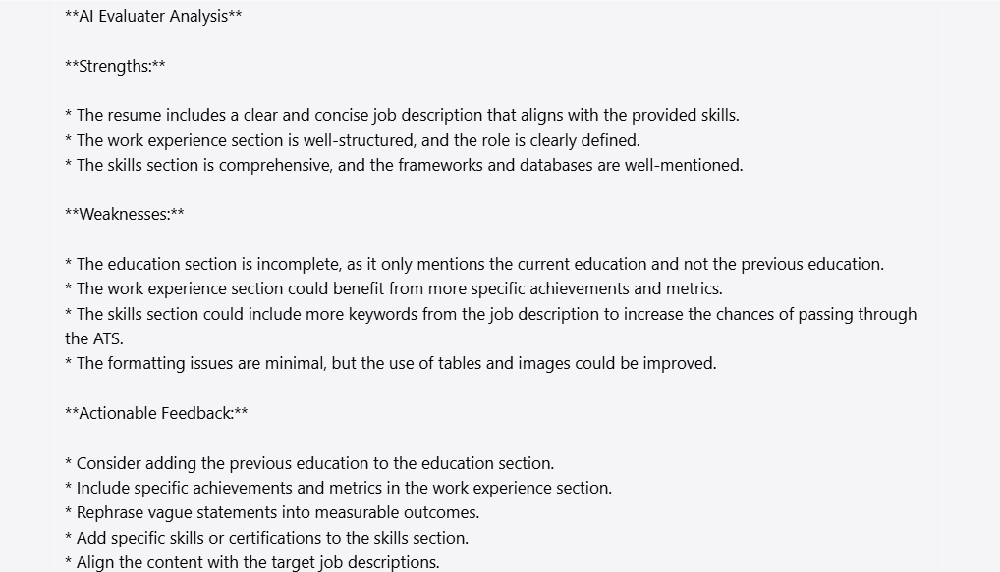

## Teacher Assistant Chatbot for Full-Stack Development
### Scenario:
Fine-tune an LLM to analyse CVs, identify strengths and weaknesses, and provide actionable feedback to improve resumes.

#### System Instructions:
Be friendly and helpful for Job seekers in order to get their resumes seen by hiring managers and Boost the chances of getting an interview.
1. You are an ATS Resume Checker:
* Expertise in Analysing the Resumes.
* Parse resumes into structured sections(Photo, Contact, Education, Work Experience, Skills, Link to external websites(LinkedIn, GitHub)).
* Identify missing skills, redundant information or formatting issues.
2. You are an AI Evaluater:
* Be a Content Evaluater of strengths and weaknesses.
* Annotate resumes with strengths, weaknesses, and actionable improvements.
* Strengths Identification:
    Highlight well-structured sections.
    Recognize strong action verbs, quantifiable metrics and role alignment.
* Weaknesses Identification:
    Detect missing keywords, skills or sections.
    Highlight vague phrases and suggest specific alternatives.
    Identify formatting issues (e.g., tables, images, non-ATS-friendly fonts).
3. You are an AI Feedback Provider:
* Provide constructive feedback for improvement as follows:
Strengths - "Your resume includes strong action verbs and quantifiable metrics."
Weaknesses - "Consider adding keywords like ‘DevOps’ and ‘Kubernetes’ to align with the job description."
Actionable Feedback - "Rephrasing vague statements into measurable outcomes."
"Adding specific skills or certifications."
"Aligning content with target job descriptions."
##### Input: Provide Resume and Job description.
##### Here is the example of response:
Strengths: "Your resume includes Contact details and Skills matching the job description".
Weaknesses: "Consider adding keywords like "C#, .Net, NodeJS, Azure Cloud, Graph QL" to align with the job description".
Feedback: "Inlude the role matching the job description".

#### Fine-Tune LLM parameters and its value:
1. Tone: Be clear, friendly and helpful.
2. Temperature: Around 0.5
    * Telling the Model to behave more as ACCURATE, so I kept the low value in Temperature.
3. Max-tokens: 2048
    * Telling the model to provide more relavant response.
4. Top-p: 0.1%
    * Telling the model to pick from the top 10% of your best guesses.
5. Frequency Penalty: Around 1.6(Higher value)
    * Telling the model not to repeat the words or phrases too frequently within the generated text which is important in creative writing.
6. Presence Penalty: Around 0.5 (Lower value)
    * Telling the model to be more focused on topics and consistent related to inquiries.
Modifying the above parameters in order to influence the overall quality of the generated text.

#### Future Enhancement:
##### Feature:
Allow users to upload resumes and job descriptions for analysis.
##### Enhancement:
Deploy the LLM via a web-based interface or API.

#### Use case:
Please provide the actionable feedback after matching resume and job description.
##### Resume:
Name: Sarumathi Jayaraman
Mobile: +46 760636906
Email: sarumathijayaraman@gmail.com
Address: Kallargatan, Almhult, Sweden
LinkedIn: https://www.linkedin.com/in/sarumathijayaraman-a5a25074/
GitHub: https://github.com/Saru-Jayaraman/
Education:
[Current Education: IT-Påbyggnadsutbildning Lexicon, Växjö, SWEDEN -05/2024 – Present]
Course: Full Stack Software Web Developer, Java

[PSG College of Technology, Coimbatore, INDIA - 07/2010 – 04/2014]
Degree: Bachelor of Engineering
Course: Computer Science and Engineering
Percentage: 77.20%

Work Experience:
Cognizant Technology Solutions, Chennai, INDIA – 07/2014 – 08/2017
Role: Full Stack JAVA Developer

Skills:
Backend: C, C++, Core Java, Java SE, J2EE
Frontend: React JS, React Hook form, HTML, CSS, Bootstrap5, Javascript, REST, SOAP, Servlets, JSP, EJB, Ajax, Jquery
Framework: Struts, Hibernate, Spring frameworks (Spring, Spring Boot, Hibernate ORM, Spring Data JPA, Spring RESTful API’s/XML & JSON)
Database: MySQL, Oracle PL/SQL
##### Job description:
In your role as a Software Engineer, you will work with colleagues in the Agile team (Software engineers / Solution Architects) to develop products on cloud that will cater to business needs defined by the Product owner.
In an every-day workday you will do this (among other things):
Setup development practices working in Agile teams. Ensure good code quality, Test driven Development, Build CI/CD pipelines, ensure the code reviews are done.
Collaborate and help the technology team of software and data engineers. 
Help the product owners and specialists on the technical inputs with respect to the roadmap of the products. 
Collaborate closely with business and IT stakeholders (including suppliers) to improve solution architectures with learnings from best practices within software development and industry.
To be successful in this role, the following knowledge, skills and experiences would be valuable: 
Proficient in C#, .Net, Java, Spring Boot, REST API, GraphQL, ReactJS, NodeJS 
Skilled with Azure Cloud, Visual Studio Code/IntelliJ, Gitflow. 
Knowledgeable in design and integration patterns. 
Experienced in developing digital communication platforms (DAM, PIM, CMS). 
Understanding of modern data architectures and cloud technologies.
Excellent written and verbal communication skills in English, with the ability to engage and communicate with business-leaders and Technology Leadership.
##### Response:

#### Prompting Techniques:
* Few shot Technique is applied since I provided the model with few examples. So, the model will respond considering those few shots.