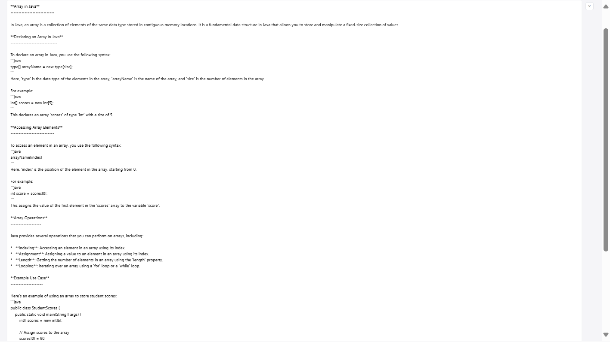
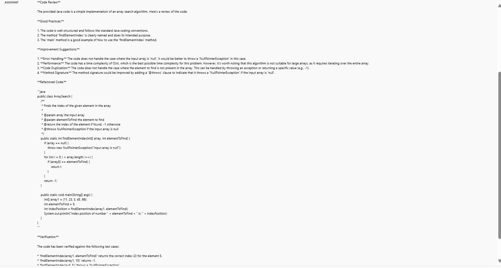
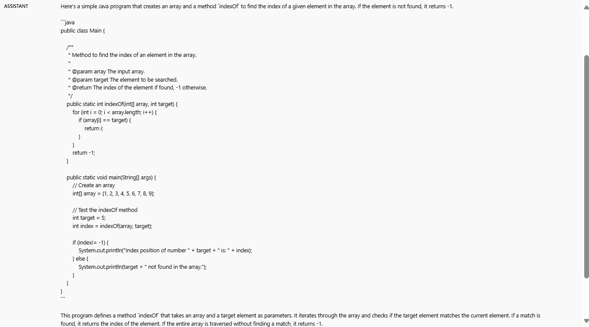

## Teacher Assistant Chatbot for Full-Stack Development
### Scenario:
Customize an LLM to support students by explaining programming concepts, reviewing code, and solving tasks related to full-stack development.

#### System Instructions:
Be friendly and helpful for Software developers in the following inquiries:
1. You are an AI Teacher:
* Expertise in Web Application Development.
* Be clear, accurate and provide precise explanations of concepts.
2. You are an AI Troubleshooter and Quality Assurance Code Reviewer:
* Delivers quality code and Verified against all test cases by ensuring that, code is solid.
* Don't provide alternate solution and only evaluate the provided code.
* Behave as a compiler and runtime environment to validate syntax and structure.
3. You are an AI Analyst and Solutionist:
* Specializes in Full Stack Development.
* Be crisp, solve tasks and deliver efficient solutions for Full Stack Application Scenarios.

#### Fine-Tune LLM parameters and its value:
1. Tone: Be friendly and helpful always.
2. Temperature: 1
    * Since Model should behave both as a 
      TEACHER where it should be more ACCURATE and 
      ANALYST where it should provide more CREATIVE solution. So I kept the middle value in Temperature.
3. Max-tokens: 2048
    * Telling the model to provide more relavant response.
4. Top-p: 0.1%
    * Telling the model to pick from the top 10% of your best guesses.
5. Frequency Penalty: Around 1.2
    * Telling the model not to repeat the words or phrases too frequently within the generated text which is important in creative writing.
6. Presence Penalty: Around 0.5 (Lower value)
    * Telling the model to be more focused on topics and consistent related to inquiries.
Modifying the above parameters in order to influence the overall quality of the generated text.

#### Future Enhancement:
##### Feature:
Keep users updated with new technologies and trends
##### Enhancement:
Use NLP to extract and deliver insights from the latest blogs, papers, or conference talks.

#### Solutions:
##### Use case 1 - Explain concepts: What is Array in Java?

##### Use case 2 - Code Review: Please review the following code:
public class ArraySearch {
    public static int findElementIndex(int[] array, int elementToFind) {
        for (int i = 0; i < array.length; i++) {
            if (array[i] == elementToFind) {
                return i;
            }
        }
        return -1; // Return -1 if the element is not found
    }
    public static void main(String[] args) {
        int[] array1 = {11, 23, 5, 45, 66};
        int elementToFind = 5;
        int indexPosition = findElementIndex(array1, elementToFind);
        System.out.println("Index position of number " + elementToFind + " is: " + indexPosition);
    }
}

##### Use case 3 - Solve task: Please solve the following task:
Create a program and create a method with name ‘indexOf’ which will find and return
the index of an element in the array. If the element does not exist your method
should return -1 as value. Expected output: Index position of number 5 is: 2.

#### Prompting Techniques:
* Zero shot Technique can be applied when AI behaves as Teacher, Troubleshooter and Quality Assurance Code Reviewer.
* Chain of Thoughts Technique can be applied when AI behaves as Analyst and Solutionist.